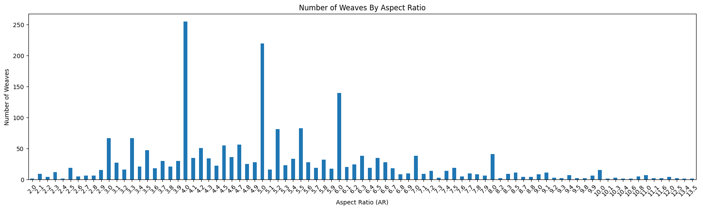
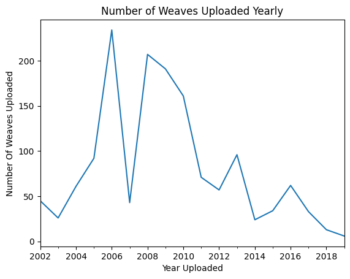

# Chainmail Stats

## Overview

The purpose of this project is to answer questions about chainmaille using data from the [Maille Artisans International League website](https://www.mailleartisans.org/), and provide a dataset that can be used by others.

## Responsibility

Looking at [M.A.I.L.'s robots.txt](https://www.mailleartisans.org/robots.txt) private use bots are allowed to request the weave article pages with a 10 second delay between each request.

## Steps

1. Determine what questions to answer.
    * What are the most commonly used Aspect ratios?
    * What tags are the most popular?
    * How many new weaves came out over time? 
2. Determine what information is needed about each weave to answer the questions.
    * The name of each weave.
    * The aspect ratios for the weaves.
    * The number of articles submitted about the weave.
    * The tags for each weave.
    * The upload/edit dates for each weave.
3. Get the data from the weave article pages and create a dataset.
4. Use the dataset to answer the questions from Step 1.

## Quick Answers

Below are quick answers to the questions from Step 1 however if you are interested there is more detailed information available in the [Process Data Notebook](Notebooks/process_data.ipynb).

### **Most Commonly Used Aspect Ratios**

The only aspect ratios used in more than 100 different weaves are $4$, $5$ and $6$.

### **Most Popular Tags**

There are 32 unique tags with the three most popular being *Variant*, *European* and *Chain* which all can be found on more than 10% of all tags each.

### **How Many Weaves Came Out Over Time**

Weaves have been uploaded to M.A.I.L. from 2002 to 2019 with the most active time period being from 2005 to 2010 with the exception of a large dip in 2006.

## Future Improvements

* Improve parsing of web-scraping to avoid improper strings in Min AR values.
* Include CSV format dataset in addition to json dataset.